<h1 align="center">🎮 GameVault</h1>
<h3 align="center">Gestor de videojuegos con Firebase Authentication y Realtime Database</h3>

  

---

## 🔥 Configuración Firebase Database

Configura Firebase paso a paso para comenzar a trabajar con GameVault:

1. **Habilitar Realtime Database en Firebase Console**  
    

2. **Configurar reglas de seguridad**  
   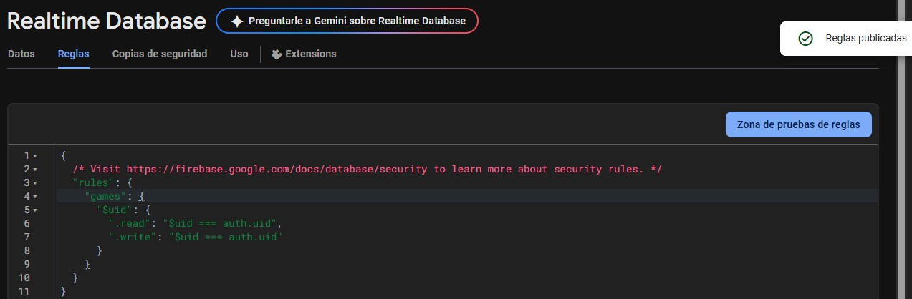

3. **Agregar dependencia en `build.gradle`**  
   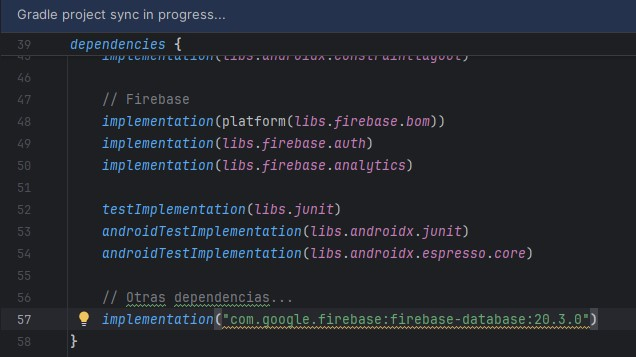

---

## 💾 Registro de Juegos

Todo comienza con un formulario intuitivo para agregar juegos a tu biblioteca personal.

- 🧩 **Crear modelo `Game.kt`**  
  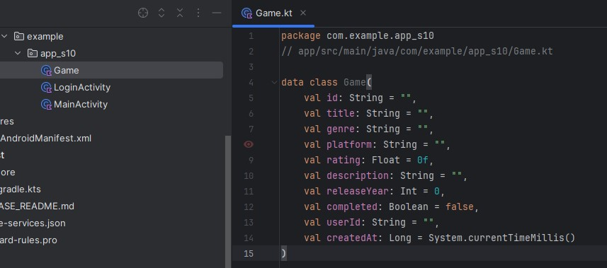

- 🛠️ **Implementar `AddGameActivity.kt`**  
  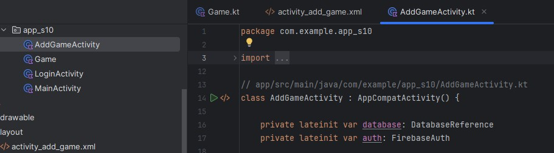

- ✅ **Crear formulario con validaciones**  
  

---

## 📋 Lista de Juegos

Visualiza tus juegos registrados en una lista dinámica con datos en tiempo real.

- 🧱 **RecyclerView con `GameAdapter`**  
  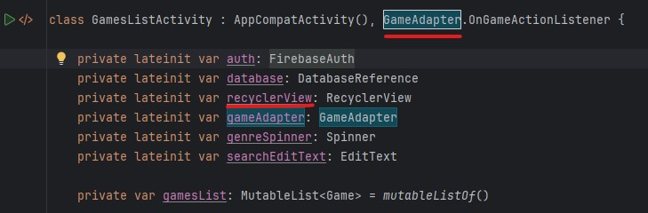

- 🙋‍♂️ **Mostrar datos del usuario autenticado**  
  

| Funcionalidad              | Imagen                                                                 |
|---------------------------|------------------------------------------------------------------------|
| ✏️ Editar juegos           | 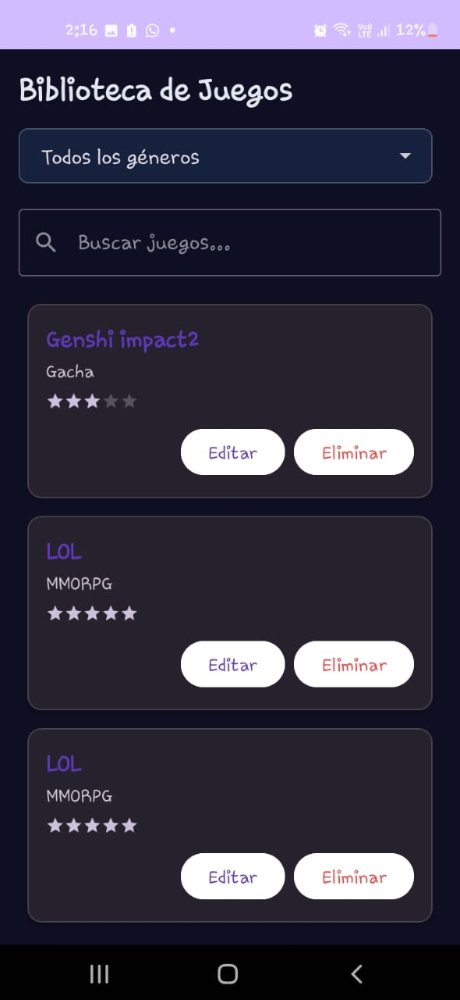 &nbsp; 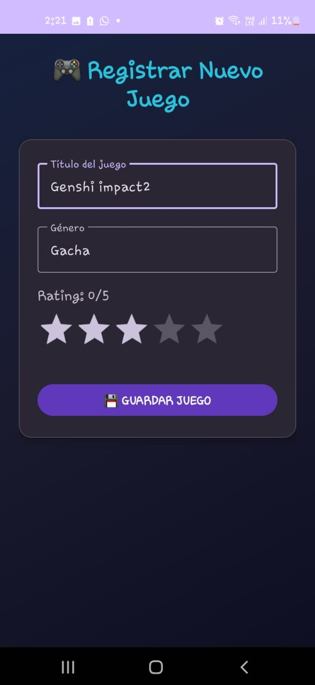 &nbsp;  |
| 🗑️ Eliminar juegos         | 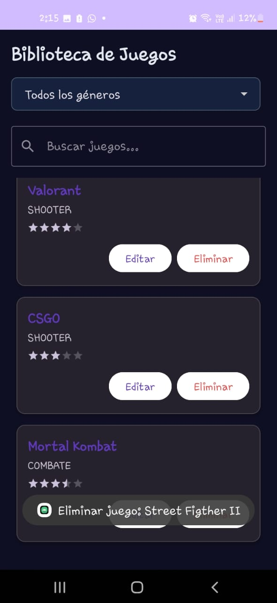 &nbsp;&nbsp; 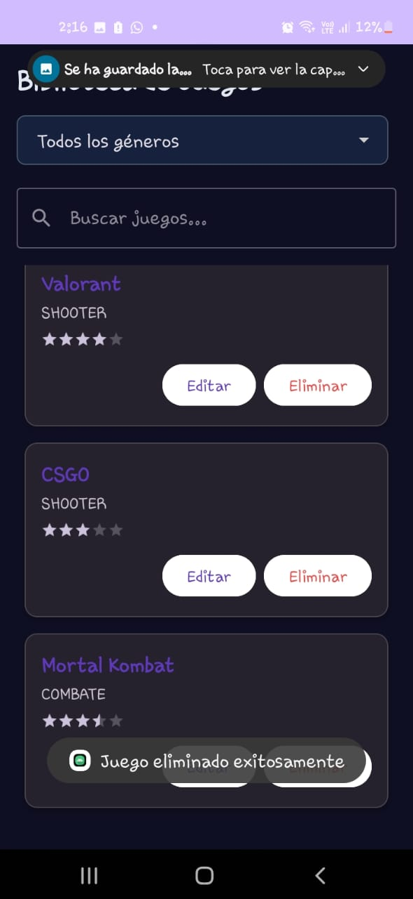 |
| 🎯 Filtro por género       | 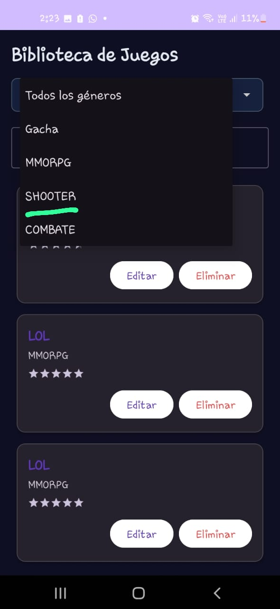 &nbsp;&nbsp; 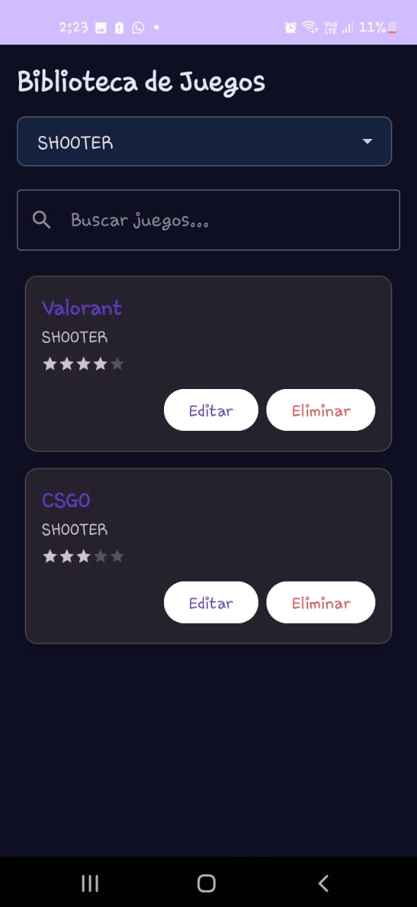 |
| 🔍 Búsqueda por título     | 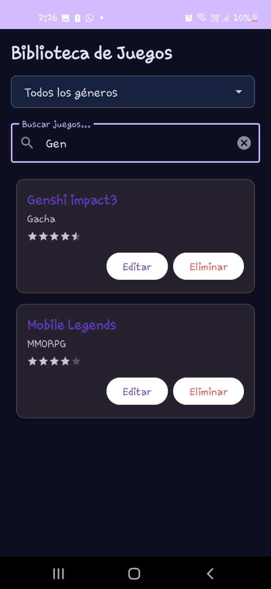 |

---

## 🛠 Tecnologías Utilizadas

- 🧩 Kotlin
- 🔐 Firebase Authentication
- 🌐 Firebase Realtime Database
- 📱 Android Studio
- 📦 RecyclerView

---

